# RECIPE NUTRITION APP

  

  
Angular is a TypeScript-based open-source web application framework led by the Angular Team at Google and by a community of individuals and corporations.

## Description

Final Project Assignment for Telerik Academy Aplpha with JavaScript - Design and implement single-page web application that will allow restaurant chefs to create and manage recipes composed of products with known nutrition values. During the interaction with the system users should see changes in nutrition information in real time. Newly created recipes could be tagged with a category from a list.

### Project Features

- Authenticate users - Register, Login, Logout
- Users can CRUD recipes
- Users can search list of recipes by name or filter by category
- Users can search for product and filter by product group

### Tools and Libraries

- Angular 7
- Boostrap 4 (NGBootstrap)
- FontAwesome 5

----------

# Getting started

## Installation

Clone the repository

    git clone https://gitlab.com/ChainVertigo/fourth-project.git

Switch to the repo folder

    cd fourth-project
    
Install dependencies
    
    npm install

----------

## Development server

Run `ng serve` for a dev server. Navigate to `http://localhost:4200/`. The app will automatically reload if you change any of the source files.

## Build

Run `ng build` to build the project. The build artifacts will be stored in the `dist/` directory. Use the `--prod` flag for a production build.

## Running unit tests

Run `ng test` to execute the unit tests via [Karma](https://karma-runner.github.io).

----------

# Documentation

The App handles user authentication so you can register and then login (click the images to enlarge):

<a href="https://raw.githubusercontent.com/JoomFX/chefsbook-frontend/master/screenshots/home.png" target="_blank">
  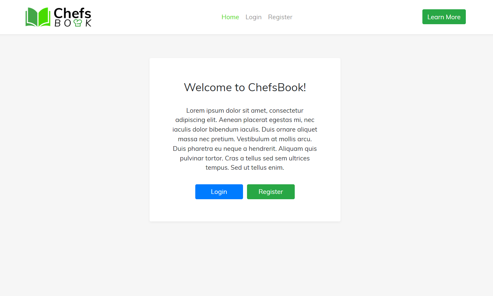
</a>

<a href="https://raw.githubusercontent.com/JoomFX/chefsbook-frontend/master/screenshots/login.png" target="_blank">
  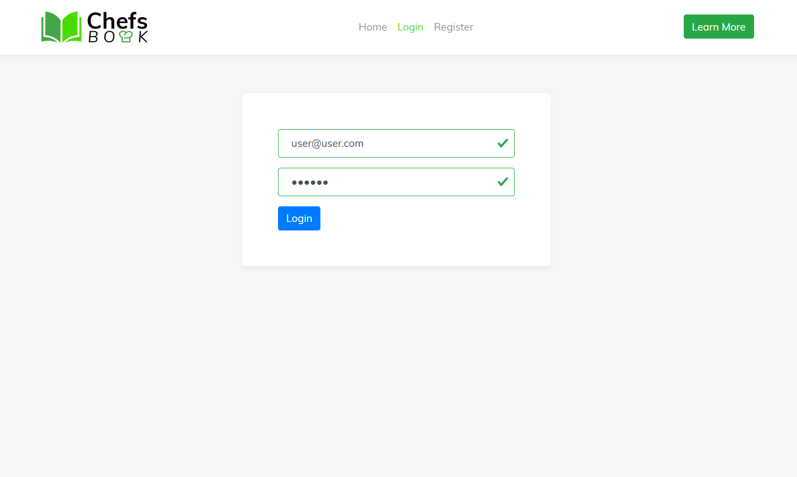
</a>

<a href="https://raw.githubusercontent.com/JoomFX/chefsbook-frontend/master/screenshots/register.png" target="_blank">
  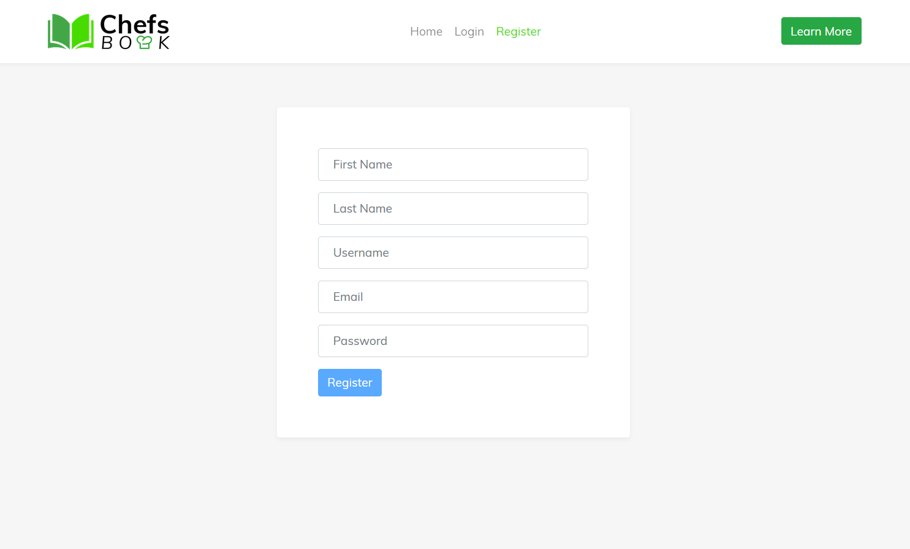
</a>

 
 

After login, you will be forwarded to the List Recipes view where you can see all your recipes. In this view you can search the recipes by name and/or filter them by category:

<a href="https://raw.githubusercontent.com/JoomFX/chefsbook-frontend/master/screenshots/list-recipes.png" target="_blank">
  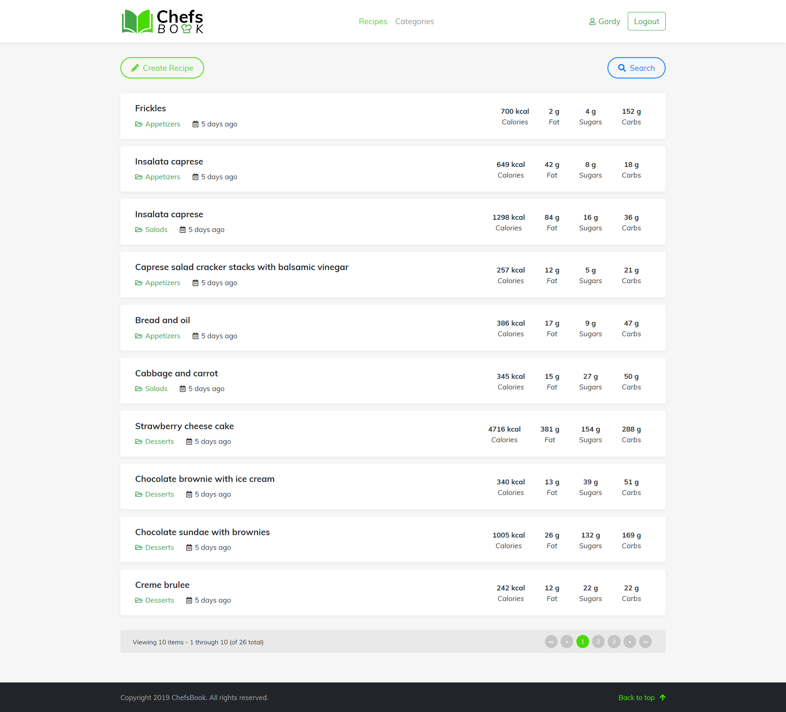
</a>

<a href="https://raw.githubusercontent.com/JoomFX/chefsbook-frontend/master/screenshots/list-recipes-search.png" target="_blank">
  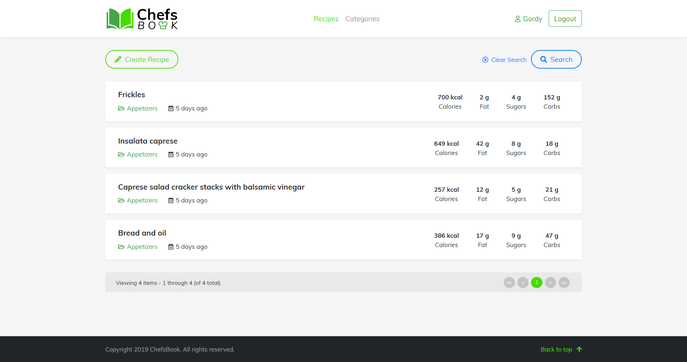
</a>

 
 

You can open a given recipe in its own detailed view, where you can see all the details about it:

<a href="https://raw.githubusercontent.com/JoomFX/chefsbook-frontend/master/screenshots/single-view1.png" target="_blank">
  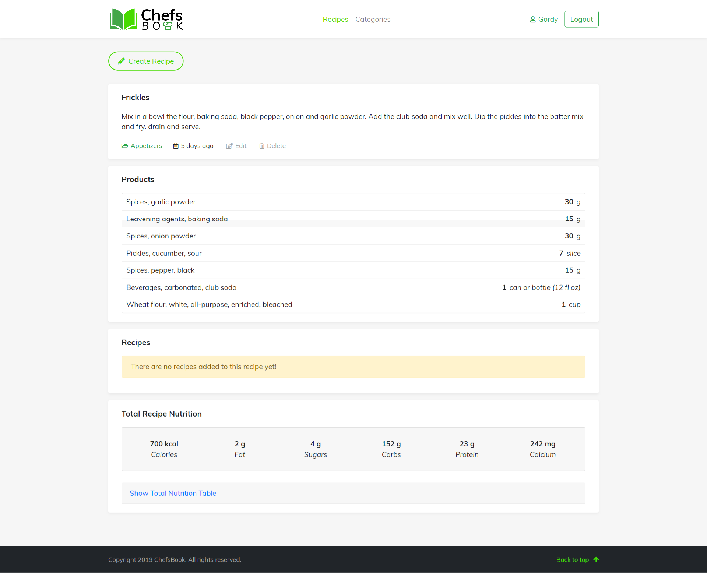
</a>

<a href="https://raw.githubusercontent.com/JoomFX/chefsbook-frontend/master/screenshots/single-view2.png" target="_blank">
  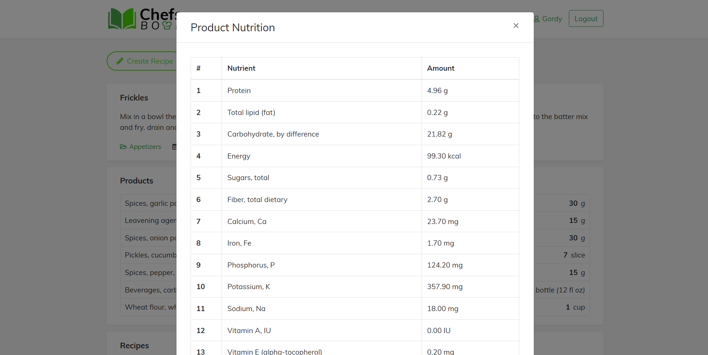
</a>

 
 

The most advanced part of the App is the Create Recipe view where you can create new recipes by adding Products and Recipes to the recipe:

<a href="https://raw.githubusercontent.com/JoomFX/chefsbook-frontend/master/screenshots/create-view1.png" target="_blank">
  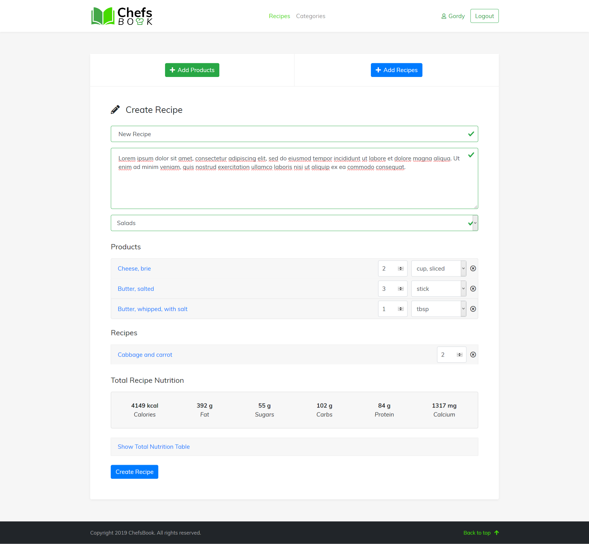
</a>

<a href="https://raw.githubusercontent.com/JoomFX/chefsbook-frontend/master/screenshots/create-view2.png" target="_blank">
  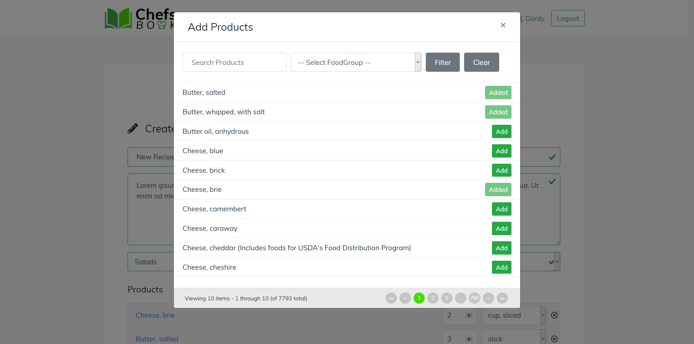
</a>

<a href="https://raw.githubusercontent.com/JoomFX/chefsbook-frontend/master/screenshots/create-view3.png" target="_blank">
  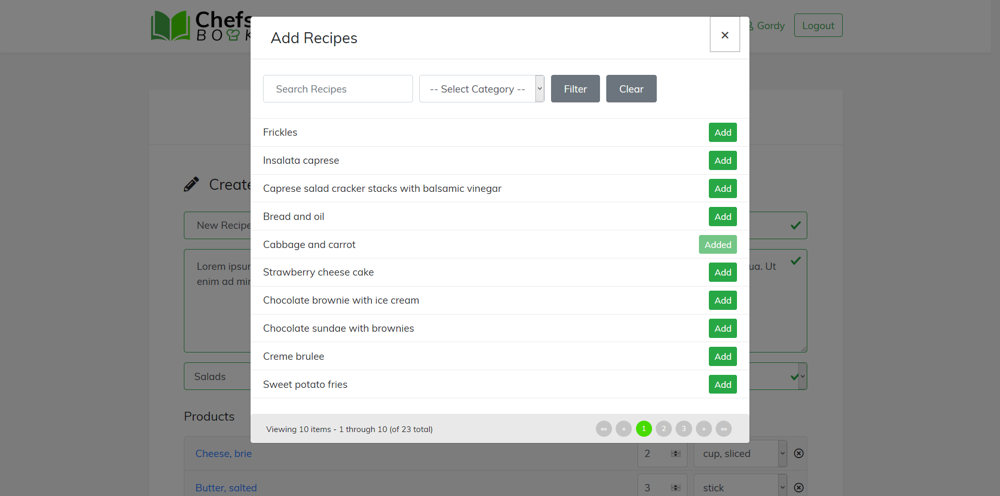
</a>

 
 

There are also a Category page where you can filter the recipes by category and a User Profile page where you can see some basic details about yourself.

<a href="https://raw.githubusercontent.com/JoomFX/chefsbook-frontend/master/screenshots/categories-view.png" target="_blank">
  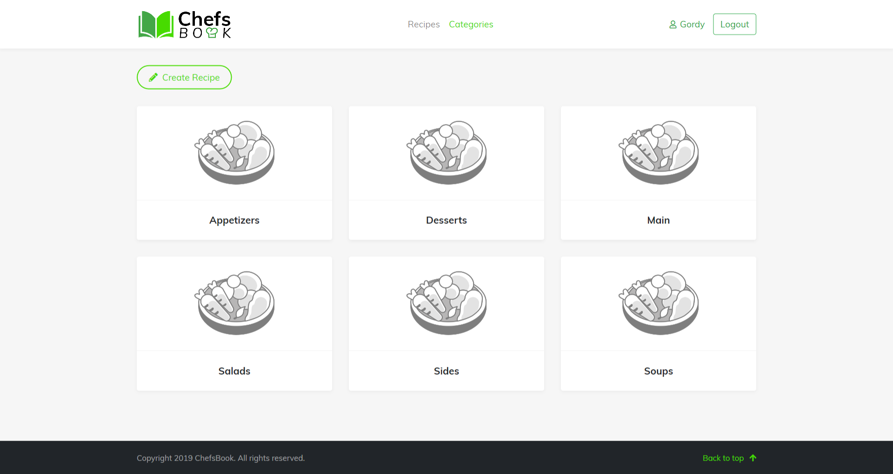
</a>

<a href="https://raw.githubusercontent.com/JoomFX/chefsbook-frontend/master/screenshots/user-view.png" target="_blank">
  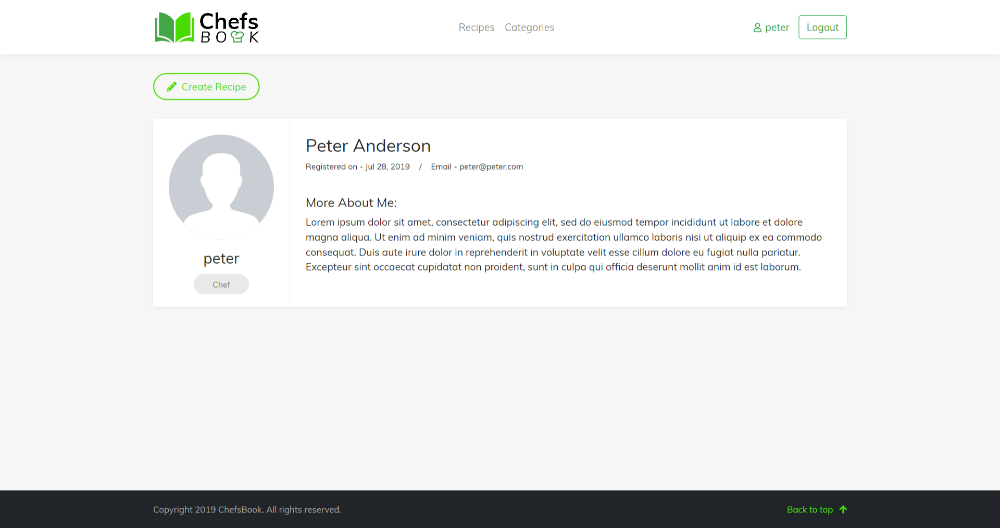
</a>